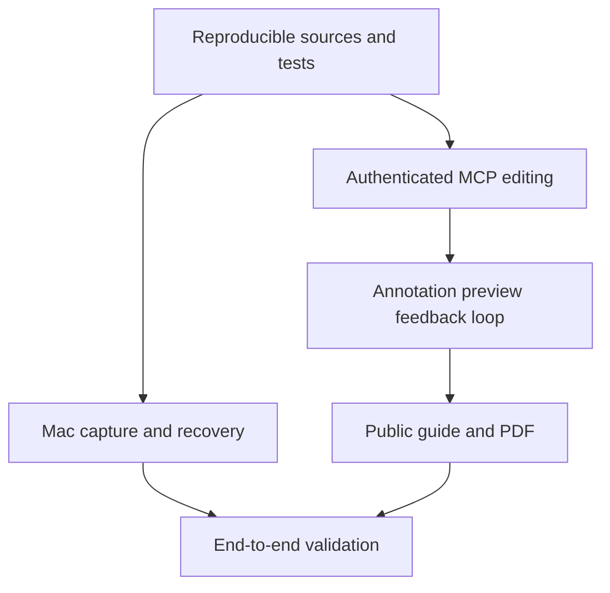

# Captuto: human recording, agent-authored guides

## Accepted scope
A human records a desktop workflow and narration. An external agent (Codex first)
reads captures, audio, transcript and click positions, writes a guide for a new
colleague, adds editable annotations, inspects rendered images and iterates.
It can publish and export on explicit instruction. The target application is
never controlled by Captuto's MCP. macOS and web are in scope; Chrome work is not.

## Delivery criteria
- Native Mac recorder is simple, recoverable and captures audio and image-relative positions.
- Without a token, Mac offers browser sign-in and automatically receives its own revocable access. No copy/paste or token in a URL is required.
- Authenticated MCP lists recordings, retrieves sources, edits content and annotations,
  returns actual preview images, publishes and exports PDFs. Ownership is enforced.
- Arrows, rectangles, text, highlights and existing annotation types remain editable.
- Preview and PDF use the same annotation renderer; PDF text is selectable and paginated.
- Public guide prioritizes readable instructions and images, with a downloadable PDF.
- Saving during typing preserves newer edits. Failures are visible and retryable.
- A reproducible local smoke scenario exercises the MCP without recording another demo.
- Web verified with agent-browser; Mac built and tested with native tooling.

## Design
Simple, warm, recognizable; companions.build is the visual reference. Light paper,
dark typography, restrained coral accents. Native Mac controls adapt to the OS;
Liquid Glass only where supported, functional fallback on older supported systems.

## Dependencies

## Test boundaries
Authenticated tool calls, recording ingestion, render outputs and existing editor
save boundary. Test observable results, rejected cross-user access, invalid geometry,
source preservation and actual PDF/image artifacts. No target-app automation.

## Exclusions
Chrome development, autonomous target-app manipulation, custom PDF template builder,
commercial billing redesign and a second built-in agent reasoning engine.
